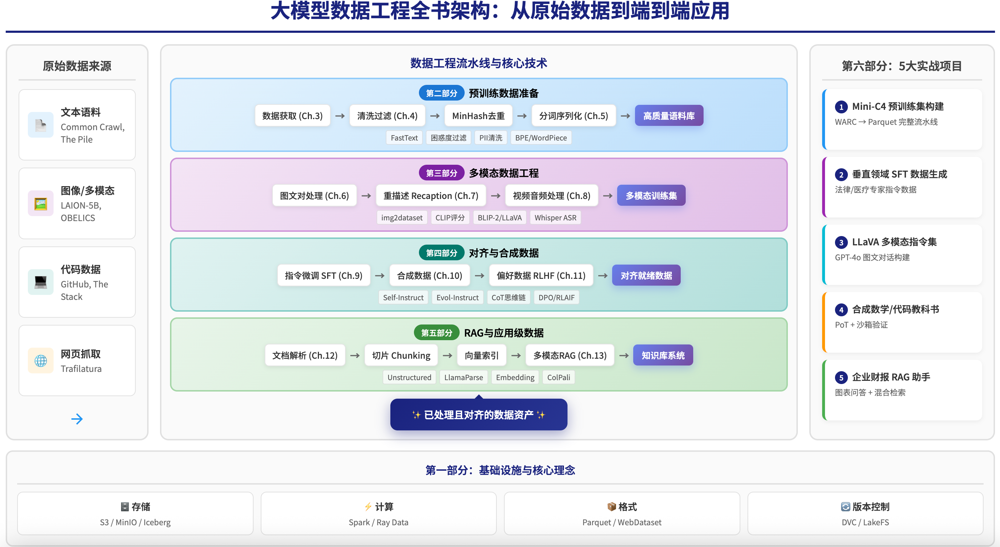

# 《大模型数据工程：架构、算法及项目实战》

[](https://datascale-ai.github.io/data_engineering_book/)
[](LICENSE)

**[English](README_en.md) | 中文**

## 简介

> *"Data is the new oil, but only if you know how to refine it."*

在大模型时代，**数据质量决定模型上限**。然而，市面上关于 LLM 数据工程的系统性资料极为稀缺——大多数团队仍在"摸着石头过河"。

本书正是为解决这一痛点而生。我们系统性地梳理了从**预训练数据清洗**到**多模态对齐**、从 **RAG 检索增强**到**合成数据生成**的完整技术体系，涵盖：

- 🧹 **预训练数据工程**：如何从 Common Crawl 等海量噪声数据中提炼出高质量语料
- 🖼️ **多模态数据处理**：图文对、视频、音频数据的采集、清洗与对齐
- 🎯 **对齐数据构造**：SFT 指令数据、RLHF 偏好数据、CoT 推理数据的自动化生成
- 🔍 **RAG 数据流水线**：企业级文档解析、语义切片与多模态检索

本书不仅有深入的理论讲解，更包含 **5 个端到端实战项目**，提供可运行的代码和详细的架构设计，让你能够**即学即用**。

**在线阅读**: [https://datascale-ai.github.io/data_engineering_book/](https://datascale-ai.github.io/data_engineering_book/)

## 全书架构



*从原始数据到端到端应用的完整数据工程流水线*

## 目录结构

```
📖 全书六大部分，13章 + 5个实战项目
│
├── 第一部分：基础设施与核心理念
│   ├── 第1章：大模型时代的数据变革（从 Data Ops 到 AI Ops）
│   └── 第2章：AI 原生数据栈
│
├── 第二部分：海量文本预训练工程
│   ├── 第3章：数据获取
│   ├── 第4章：清洗与质量控制
│   └── 第5章：分词、序列化与高效加载
│
├── 第三部分：多模态数据工程
│   ├── 第6章：图文对数据处理
│   ├── 第7章：数据重描述
│   └── 第8章：视频与音频数据
│
├── 第四部分：对齐与合成数据工程
│   ├── 第9章：指令微调数据
│   ├── 第10章：合成数据
│   └── 第11章：人类偏好数据
│
├── 第五部分：应用级数据工程
│   ├── 第12章：RAG数据流水线
│   └── 第13章：多模态RAG
│
└── 第六部分：实战项目集
    ├── 项目一：构建"Mini-C4"预训练集
    ├── 项目二：垂直领域专家SFT（法律）
    ├── 项目三：构建LLaVA多模态指令集
    ├── 项目四：合成数学/代码教科书
    └── 项目五：多模态RAG企业财报助手
```

## 核心亮点

### 理论体系完整
- **Data-Centric AI** 理念贯穿全书
- 覆盖 LLM 数据全生命周期：预训练 → 微调 → RLHF → RAG
- 深入讲解 Scaling Laws、数据质量评估、多模态对齐等前沿话题

### 技术栈现代化
| 领域 | 技术选型 |
|------|----------|
| 分布式计算 | Ray Data, Spark, Dask |
| 数据存储 | Parquet, WebDataset, 向量数据库 (Milvus/Qdrant) |
| 文本处理 | Trafilatura, KenLM, MinHash LSH, fastText 质量评分 |
| 多模态 | CLIP, ColPali, img2dataset |
| 数据版本 | DVC, LakeFS, Pachyderm |

### 实战项目丰富

| 项目 | 核心技术 | 输出 |
|------|----------|------|
| Mini-C4 预训练集 | Trafilatura + Ray + MinHash | 高质量文本语料库 |
| 法律专家 SFT | Self-Instruct + CoT | 领域指令数据集 |
| LLaVA 多模态 | Bbox 对齐 + 多图交错 | 视觉指令数据集 |
| 数学教科书 | Evol-Instruct + 沙箱验证 | PoT 推理数据集 |
| 财报 RAG | ColPali + Qwen-VL | 多模态问答系统 |

## 本地运行

### 环境要求

- Python 3.8+
- MkDocs Material
- mkdocs-static-i18n（多语言支持）

### 安装与预览

```bash
# 克隆仓库
git clone https://github.com/datascale-ai/data_engineering_book.git
cd data_engineering_book

# 安装依赖
pip install mkdocs-material mkdocs-glightbox pymdown-extensions "mkdocs-static-i18n[material]"

# 本地预览
mkdocs serve
```

访问 http://127.0.0.1:8000 即可预览书籍（支持中英文切换）。

### 构建静态站点

```bash
mkdocs build
```

生成的静态文件位于 `site/` 目录。

## 项目结构

```
data_engineering_book/
├── docs/
│   ├── zh/                  # 中文内容
│   │   ├── index.md         # 中文首页
│   │   └── part1/ ~ part6/  # 各章节
│   ├── en/                  # 英文内容
│   │   ├── index.md         # 英文首页
│   │   └── part1/ ~ part6/  # 各章节
│   ├── images/              # 图片资源（中英共享）
│   ├── stylesheets/         # 自定义样式
│   └── javascripts/         # JavaScript (MathJax等)
├── .github/workflows/       # GitHub Actions 自动部署
├── images/                  # 项目图片资源
│   ├── structure_cn.png     # 全书架构图（中文）
│   └── structure_en.png     # 全书架构图（英文）
├── mkdocs.yml               # MkDocs 配置文件
├── LICENSE                  # 开源协议
├── README.md                # 中文说明（本文件）
└── README_en.md             # English README
```

## 适合读者

- 大模型研发工程师
- 数据工程师 / MLOps 工程师
- AI 产品经理（技术向）
- 对 LLM 数据流水线感兴趣的研究人员

## 贡献指南

欢迎提交 Issue 和 Pull Request！

1. Fork 本仓库
2. 创建特性分支 (`git checkout -b feature/AmazingFeature`)
3. 提交更改 (`git commit -m 'Add some AmazingFeature'`)
4. 推送到分支 (`git push origin feature/AmazingFeature`)
5. 提交 Pull Request

## 许可证

本项目采用 MIT 许可证 - 详见 [LICENSE](LICENSE) 文件。

## 联系我们

- GitHub Issues: [提交问题](https://github.com/datascale-ai/data_engineering_book/issues)
- 在线阅读: [https://datascale-ai.github.io/data_engineering_book/](https://datascale-ai.github.io/data_engineering_book/)

---

**如果这本书对你有帮助，欢迎 Star 支持！** ⭐
