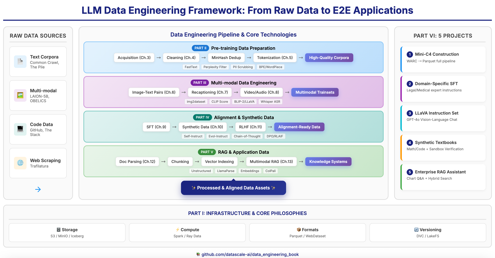

# Data Engineering for Large Models: Architecture, Algorithms & Projects

[](https://datascale-ai.github.io/data_engineering_book/en/)
[](LICENSE)

**English | [中文](README.md)**

## Introduction

> *"Data is the new oil, but only if you know how to refine it."*

In the era of large models, **data quality determines the upper bound of model performance**. Yet systematic resources on LLM data engineering remain extremely scarce — most teams are still learning by trial and error.

This book is designed to fill that gap. We systematically cover the complete technical stack from **pre-training data cleaning** to **multimodal alignment**, from **RAG retrieval augmentation** to **synthetic data generation**, including:

- 🧹 **Pre-training Data Engineering**: Extracting high-quality corpora from massive noisy data sources like Common Crawl
- 🖼️ **Multimodal Data Processing**: Collection, cleaning, and alignment of image-text pairs, video, and audio data
- 🎯 **Alignment Data Construction**: Automated generation of SFT instruction data, RLHF preference data, and CoT reasoning data
- 🔍 **RAG Data Pipeline**: Enterprise-grade document parsing, semantic chunking, and multimodal retrieval

Beyond in-depth theoretical explanations, the book includes **5 end-to-end capstone projects** with runnable code and detailed architecture designs for hands-on learning.

**Read Online**: [https://datascale-ai.github.io/data_engineering_book/en/](https://datascale-ai.github.io/data_engineering_book/en/)

## Book Architecture



*A complete data engineering pipeline from raw data to end-to-end applications*

## Table of Contents

```
📖 6 Parts, 13 Chapters + 5 Capstone Projects
│
├── Part 1: Infrastructure & Core Concepts
│   ├── Chapter 1: Data Revolution in the LLM Era (From Data Ops to AI Ops)
│   └── Chapter 2: AI-Native Data Stack
│
├── Part 2: Large-Scale Text Pre-training Engineering
│   ├── Chapter 3: Data Acquisition
│   ├── Chapter 4: Cleaning & Quality Control
│   └── Chapter 5: Tokenization, Serialization & Efficient Loading
│
├── Part 3: Multimodal Data Engineering
│   ├── Chapter 6: Image-Text Pair Processing
│   ├── Chapter 7: Recaptioning
│   └── Chapter 8: Video & Audio Data
│
├── Part 4: Alignment & Synthetic Data Engineering
│   ├── Chapter 9: Instruction Fine-tuning Data
│   ├── Chapter 10: Synthetic Data
│   └── Chapter 11: Human Preference Data
│
├── Part 5: Application-level Data Engineering
│   ├── Chapter 12: RAG Data Pipeline
│   └── Chapter 13: Multimodal RAG
│
└── Part 6: Capstone Projects
    ├── Project 1: Building Mini-C4 Pre-training Set
    ├── Project 2: Domain Expert SFT (Legal)
    ├── Project 3: Building LLaVA Multimodal Instruction Set
    ├── Project 4: Synthetic Math/Code Textbook
    └── Project 5: Multimodal RAG Financial Report Assistant
```

## Key Highlights

### Comprehensive Theory
- **Data-Centric AI** philosophy throughout
- Covers the full LLM data lifecycle: Pre-training → Fine-tuning → RLHF → RAG
- In-depth coverage of Scaling Laws, data quality evaluation, multimodal alignment, and more

### Modern Tech Stack
| Domain | Technologies |
|--------|-------------|
| Distributed Computing | Ray Data, Spark, Dask |
| Data Storage | Parquet, WebDataset, Vector Databases (Milvus/Qdrant) |
| Text Processing | Trafilatura, KenLM, MinHash LSH, fastText Quality Scoring |
| Multimodal | CLIP, ColPali, img2dataset |
| Data Versioning | DVC, LakeFS, Pachyderm |

### Rich Capstone Projects

| Project | Core Technologies | Output |
|---------|-------------------|--------|
| Mini-C4 Pre-training Set | Trafilatura + Ray + MinHash | High-quality text corpus |
| Legal Expert SFT | Self-Instruct + CoT | Domain instruction dataset |
| LLaVA Multimodal | Bbox alignment + multi-image interleaving | Visual instruction dataset |
| Math Textbook | Evol-Instruct + sandbox verification | PoT reasoning dataset |
| Financial Report RAG | ColPali + Qwen-VL | Multimodal QA system |

## Local Development

### Requirements

- Python 3.8+
- MkDocs Material
- mkdocs-static-i18n (i18n support)

### Install & Preview

```bash
# Clone the repository
git clone https://github.com/datascale-ai/data_engineering_book.git
cd data_engineering_book

# Install dependencies
pip install mkdocs-material mkdocs-glightbox pymdown-extensions "mkdocs-static-i18n[material]"

# Local preview
mkdocs serve
```

Visit http://127.0.0.1:8000 to preview the book (with Chinese/English language switcher).

### Build Static Site

```bash
mkdocs build
```

The generated static files are located in the `site/` directory.

## Project Structure

```
data_engineering_book/
├── docs/
│   ├── zh/                  # Chinese content
│   │   ├── index.md         # Chinese homepage
│   │   └── part1/ ~ part6/  # All chapters
│   ├── en/                  # English content
│   │   ├── index.md         # English homepage
│   │   └── part1/ ~ part6/  # All chapters
│   ├── images/              # Image assets (shared)
│   ├── stylesheets/         # Custom styles
│   └── javascripts/         # JavaScript (MathJax etc.)
├── .github/workflows/       # GitHub Actions CI/CD
├── images/                  # Project image assets
│   ├── structure_cn.png     # Book architecture diagram (Chinese)
│   └── structure_en.png     # Book architecture diagram (English)
├── mkdocs.yml               # MkDocs configuration
├── LICENSE                  # License
├── README.md                # 中文说明
└── README_en.md             # English README (this file)
```

## Target Audience

- LLM R&D Engineers
- Data Engineers / MLOps Engineers
- AI Product Managers (Technical)
- Researchers interested in LLM data pipelines

## Contributing

Contributions are welcome! Feel free to submit Issues and Pull Requests.

1. Fork this repository
2. Create a feature branch (`git checkout -b feature/AmazingFeature`)
3. Commit your changes (`git commit -m 'Add some AmazingFeature'`)
4. Push to the branch (`git push origin feature/AmazingFeature`)
5. Open a Pull Request

## License

This project is licensed under the MIT License - see the [LICENSE](LICENSE) file for details.

## Contact

- GitHub Issues: [Submit an issue](https://github.com/datascale-ai/data_engineering_book/issues)
- Read Online: [https://datascale-ai.github.io/data_engineering_book/en/](https://datascale-ai.github.io/data_engineering_book/en/)

---

**If you find this book helpful, please give it a Star!** ⭐
