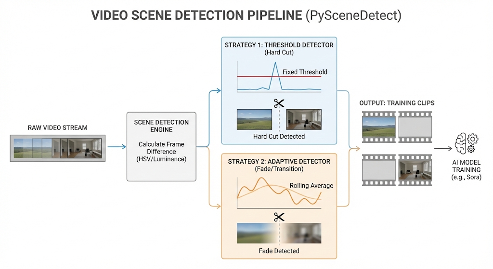

## 第8章：视频与音频数据处理

### 本章摘要

视频数据是多模态大模型（LMM）训练中数据量最大、处理难度最高、信息密度最复杂的模态，被誉为多模态工程的“深水区”。与静态图像不同，视频引入了**时间维度（Temporal Dimension）**，这意味着数据不仅仅是像素的堆叠，更是因果逻辑、物理规律和运动模式的载体。

本章将系统拆解如何将连续的、非结构化的视频流转化为模型可理解的离散 Token。我们将从底层的**镜头边界检测（Shot Boundary Detection）**入手，深入解析基于内容的切分算法；进而剖析视频生成的“心脏”——**视频 Tokenizer**，对比 VQ-VAE 与 Google DeepMind 最新 MagViT-v2 的底层原理；最后，我们将演示如何利用 **WhisperX** 实现音视频的字级（Word-level）乃至音素级（Phoneme-level）精准对齐，为模型构建时空同步的监督信号。

**学习目标**：
* **工程能力**：掌握使用 PySceneDetect 结合 ffmpeg 关键帧元数据进行两级场景切分（Coarse-to-Fine）的高效策略。
* **理论深度**：深入理解 Video Tokenization 中的“Codebook Collapse”（码本坍塌）问题，以及 MagViT-v2 如何通过 Lookup-Free Quantization (LFQ) 彻底解决这一瓶颈。
* **数据管线**：实现基于 WhisperX 的 Forced Alignment 流程，解决多说话人、背景噪音声学环境下的字幕精准对齐。
* **存储优化**：了解海量视频数据的存储分片（Sharding）与高效加载方案。

**场景引入**：
> “想象你正在训练一个像 Sora 一样的世界模型。你下载了一部 2 小时的电影《泰坦尼克号》作为训练数据。
>
> 如果你简单粗暴地按每 10 秒一段进行切分，你会遇到严重的‘语义断裂’：一段视频的前 5 秒是甲板上平静的海风，后 5 秒突然跳到了喧闹的餐厅。这种跨越场景的‘硬切’（Hard Cut）会让模型感到困惑：‘人是怎么在 0.1 秒内从室外瞬移到室内的？’这不仅浪费了算力，还让模型学到了错误的物理规律。
>
> 此外，声音的时序精度就是生命。如果你的字幕比画面慢了 2 秒，当画面中 Rose 在张嘴时，对应的 Token 却是 Jack 的台词。模型会错误地将‘Jack的声音特征’关联到‘Rose的面部特征’上。在万亿级 Token 的训练中，这种微小的错位会被放大为严重的幻觉。”

---

### 8.1 视频处理流水线：场景切分 (Scene Detection)

视频在本质上并非连续的流，而是由一个个独立的“镜头（Shot）”拼接而成的序列。每一个镜头代表了一次摄像机的开启与关闭（或视角的连续移动）。训练视频生成模型（Video Generative Models），必须保证每个训练样本（Training Clip）都在同一个镜头内，确保**时空连续性（Spatio-Temporal Continuity）**。

#### 8.1.1 视频结构的微观视角：GOP 与 I 帧
在深入切分算法之前，我们需要理解视频编码的基础。


* **I-Frame (Intra-coded picture)**：关键帧。它是一张完整的图片，不依赖其他帧即可解码。通常也是场景变换的起点。
* **P-Frame (Predicted picture)**：前向预测帧。只存储与前一帧的差异。
* **B-Frame (Bi-predictive picture)**：双向预测帧。参考前后帧进行压缩，压缩率最高。

**GOP (Group of Pictures)**：两个 I 帧之间的序列。视频播放器在拖动进度条时，通常会“吸附”到最近的 I 帧，因为解码必须从这里开始。我们的切分策略必须利用这一特性来加速。

#### 8.1.2 算法选型与策略

<figure>
  
  <figcaption align="center"><b>图 8-1：视频场景切分的两种策略与HSV直方图差异</b></figcaption>
</figure>

**PySceneDetect** 是业界标准的开源工具，它提供了多种检测器，核心逻辑基于帧间差异分析：

* **策略一：Threshold Detector (阈值检测 - 针对硬切)**
    * **原理**：计算相邻两帧在 HSV 色彩空间或 RGB 亮度上的平均差异值（Delta）。当 Delta > `threshold`（如 30.0）时，判定为切点。
    * **适用**：绝大多数电影和用户上传视频（UGC）。
    * **局限**：无法检测渐变。

* **策略二：Adaptive Detector (自适应检测 - 针对渐变/快节奏)**
    * **原理**：不再使用固定阈值，而是维护一个滑动窗口（Sliding Window）。比较“当前帧”与“窗口内平均帧差”的比率。
    * **适用**：淡入淡出（Fade In/Out）、叠化（Dissolve）或像动作片那样摄像机剧烈运动的场景。

**进阶策略：两级级联切分 (Two-Stage Cascade Splitting)**
直接对 TB 级视频全量解码运行 PySceneDetect 非常慢。我们推荐“先粗后细”的工业级方案：

1.  **Level-1 (Metadata Scan)**：利用 `ffprobe` 快速扫描视频流元数据，提取所有 **I-Frame** 的时间戳。I-Frame 往往出现在场景切换处（编码器倾向于在剧变处插入 I 帧）。此步骤无需解码画面，速度是播放速度的 100 倍以上。
2.  **Level-2 (Content Analysis)**：仅在 Level-1 识别出的潜在切点前后 ±2 秒范围内，运行 PySceneDetect 的 `ContentDetector` 进行精确的帧级定位。

#### 8.1.3 核心代码：场景切分与无损分割

以下代码演示了生产环境中的标准切分流程。注意其中的“流拷贝”技巧，这是处理海量视频时避免存储爆炸的关键。

```python
from scenedetect import detect, ContentDetector, split_video_ffmpeg
import os
import logging

# 配置日志
logging.basicConfig(level=logging.INFO, format='%(asctime)s - %(levelname)s - %(message)s')

def process_video_scenes(video_path, output_dir, threshold=27.0):
    """
    检测场景并使用 ffmpeg 无损切割视频
    Args:
        video_path: 输入视频路径
        output_dir: 输出目录
        threshold: 切分阈值 (经验值: 27.0 适合大部分 1080p 视频)
    """
    if not os.path.exists(output_dir):
        os.makedirs(output_dir)

    logging.info(f"Starting scene detection for: {video_path}")

    # 1. 场景检测
    # threshold=27.0: 基于 HSV 空间的直方图差异阈值
    # min_scene_len=15: 忽略小于 0.5秒 (30fps) 的片段。
    # 极短的片段通常是闪光灯、故障或者是切分错误的噪音，不适合作为训练数据。
    scene_list = detect(
        video_path, 
        ContentDetector(threshold=threshold, min_scene_len=15)
    )
    
    # 2. 统计与过滤
    # 在此处可以添加逻辑：比如合并过短的相邻场景，或者丢弃小于 3 秒的场景
    valid_scenes = []
    for scene in scene_list:
        start, end = scene
        duration = (end.get_frames() - start.get_frames()) / start.get_framerate()
        if duration >= 3.0: # 只保留大于3秒的片段用于训练
            valid_scenes.append(scene)

    logging.info(f"Detected {len(scene_list)} scenes, kept {len(valid_scenes)} valid scenes.")
    
    # 3. 分割视频 (Stream Copy)
    # 关键点：arg_override='-c:v copy -c:a copy'
    # 这指示 ffmpeg 直接拷贝二进制流，不进行 [解码 -> 像素 -> 编码] 的过程。
    # 优点 1：速度极快（受限于磁盘 I/O，而非 CPU）。
    # 优点 2：画质 100% 无损，没有任何重编码带来的伪影。
    split_video_ffmpeg(
        video_path, 
        valid_scenes, 
        output_dir=output_dir, 
        show_progress=True,
        arg_override='-c:v copy -c:a copy' 
    )

# 避坑指南：数据膨胀灾难
# 千万不要把切分后的视频解码成图片序列（png/jpg）或 numpy array 长期存盘！
# 算一笔账：
# 1小时 1080p H.264 视频 ≈ 2GB
# 解码后：3600秒 * 30帧 * 1920 * 1080 * 3字节 ≈ 670 GB
# 膨胀系数 > 300倍。
# 始终存储压缩格式 (mp4/mkv)，只在训练 DataLoader 的 __getitem__ 中利用 GPU (NVDEC) 实时解码。
```

---

### 8.2 视频 Tokenization：从像素海洋到离散岛屿

对于 Sora、Gen-2 这样基于 Transformer 的扩散模型（DiT），直接在像素空间（Pixel Space）建模是不可行的。一个 4 秒的 1080p 视频包含约 $3 \times 10^8$ 个像素点，计算注意力矩阵（Attention Matrix）会导致显存瞬间溢出。

因此，视频必须先被“压缩”成潜在空间（Latent Space）的离散 Token。这个过程由 **Video Tokenizer** 完成。

#### 8.2.1 传统方案的痛点：VQ-VAE 与“死码”

**VQ-VAE (Vector Quantized Variational AutoEncoder)** 是早期视频生成模型（如 VideoGPT）的基石。

* **流程**：
    1.  **Encoder**：将视频切分为 3D Patch（例如 $16 \times 16 \times 16$ 的时空块），压缩成低维向量 $z_e(x)$。
    2.  **Quantization (量化)**：维护一个 Codebook（码本），包含 $K$ 个原型向量（Embedding）。对于每个 $z_e(x)$，在 Codebook 中找到欧氏距离最近的向量 $e_k$ 来替换它。
    3.  **Decoder**：利用 $e_k$ 重建视频。

* **致命缺陷：Codebook Collapse (码本坍塌)**
    在训练初期，只有少数几个 Code（例如 Code #5 和 Code #100）偶然被选中。由于只有被选中的 Code 才会获得梯度更新，它们会变得越来越“好”，从而更容易被选中。这就形成了“富者愈富”的马太效应。
    * **后果**：Codebook 中 90% 的向量变成了“死码”（Dead Codes），从未被使用。这导致模型的有效词汇量极低，生成的视频模糊且缺乏细节。
    * **补救措施**：传统方法需要复杂的 Reset 策略（如 k-means 重置），训练极不稳定。

#### 8.2.2 SOTA 方案：MagViT-v2 与 LFQ

Google DeepMind 在 MagViT-v2 中引入了 **LFQ (Lookup-Free Quantization)**，彻底改变了游戏规则。


* **核心思想：不查表，直接算。**
    LFQ 抛弃了“寻找最近邻”的思想，而是直接根据潜在变量（Latent Variable）的**符号（Sign）**生成 Token。

* **数学原理**：
    假设 Encoder 输出的潜在向量 $z \in \mathbb{R}^D$（例如维度 $D=18$）。
    LFQ 对每一维进行二值化：
    $$q_i = \begin{cases} 1 & \text{if } z_i > 0 \\ 0 & \text{if } z_i \le 0 \end{cases}$$
    
    然后，将这 $D$ 个二进制位组合成一个整数索引（Integer Index）：
    $$\text{Token ID} = \sum_{i=0}^{D-1} q_i \cdot 2^i$$

* **为何 LFQ 是颠覆性的？**
    1.  **无限的有效码本**：如果 $D=18$，则自然形成的码本大小为 $2^{18} = 262,144$。所有这些 Code 都是由 $D$ 个独立的维度组合而成，每个维度都始终参与梯度更新。**Codebook 利用率恒定为 100%。**
    2.  **零计算成本**：没有昂贵的“全码本距离计算”，只有简单的位运算。
    3.  **时空压缩**：MagViT-v2 结合了 **3D Causal CNN**，在压缩空间的同时保留了时间因果性（即当前的 Token 不会泄露未来的信息），这对生成模型至关重要。

#### 8.2.3 架构选型对比表

| 特性 | VQ-VAE (TATS/VideoGPT) | MagViT-v2 (LFQ) |
| :--- | :--- | :--- |
| **量化机制** | Nearest Neighbor Search (查表) | Sign Function (符号函数投影) |
| **词汇表大小 (Vocab)** | 通常 1024 - 8192 (受限于显存和坍塌) | $2^{18}$ (262k) 甚至更大，轻松扩展 |
| **码本利用率** | 低 (容易坍塌，需 EMA 等技巧) | **100% (设计上避免了坍塌)** |
| **梯度反传** | 需 Straight-Through Estimator (STE) | 改进的 Entropy Penalty + STE |
| **生成质量** | 易模糊，细节纹理丢失 | 极其清晰，甚至优于原片 (去噪效应) |
| **推理速度** | 较慢 (尤其是大码本时) | 极快 |
---

从 VQ-VAE 到 MagViT-v2 的演进并非简单的参数优化，而是视频离散化技术的一次范式转移（Paradigm Shift）——即从“基于搜索的近似（Search-based Approximation）”向“基于计算的构造（Computation-based Construction）”的跨越。

首先，在计算复杂度与扩展性方面，传统的 VQ-VAE 存在根本性的瓶颈。其量化过程依赖于最近邻搜索（Nearest Neighbor Search），需要计算特征向量与码本中所有 $K$ 个原型的欧氏距离，其时间复杂度为 $O(K)$。这意味着扩大词汇表（Vocabulary Size）以提升表征能力将直接导致推理延迟的线性增长。相比之下，MagViT-v2 引入的 LFQ (Lookup-Free Quantization) 机制摒弃了查表操作，转而利用符号函数（Sign Function）将潜在变量投影为二进制串。这一过程将计算复杂度恒定降维至 $O(1)$，使得模型能够在不牺牲推理速度的前提下，轻松支撑起 $2^{18}$ 甚至更大的词汇空间，从而解决了大词汇表与低延迟不可兼得的矛盾。

其次，在码本利用率与训练稳定性方面，两者表现迥异。VQ-VAE 长期受困于“码本坍塌（Codebook Collapse）”问题，即部分编码向量因初始化或梯度分配不均而从未被激活，导致有效词汇量远小于设计值（通常仅为 1024-8192）。这迫使研究者引入 EMA（指数移动平均）或 k-means 重置等复杂的工程技巧来维持训练。而 MagViT-v2 的 LFQ 机制基于各维度的独立二值化组合，从数学结构上保证了码本空间是被“组合生成”而非“离散查找”的。只要潜在空间的各个维度保持激活，组合出的编码便能自然覆盖整个码本空间，实现了理论上 100% 的码本利用率。

综上所述，MagViT-v2 通过 LFQ 机制实现了高压缩率、高保真度与低计算成本的统一，彻底解决了传统 VQ-VAE 在细节纹理丢失和时空一致性差的缺陷。对于构建如 Sora 级别的大规模视频生成模型而言，MagViT-v2 及其衍生的 Tokenizer 架构已成为当前工业界的各种首选方案。


### 8.3 音频对齐：WhisperX 与强制对齐 (Forced Alignment)

视频不仅是视觉数据，声音（Audio）提供了天然的、时间密集的文本描述。利用音频，我们可以让模型学习到“爆炸声对应火光”、“哭声对应流泪”等多模态关联。

然而，普通的 ASR（如原始 Whisper）只能给出“句子级”的时间戳，误差通常在 1-2 秒。这对于精细的视频训练（如唇形同步 Lip-sync）是完全不够的。我们需要 **WhisperX**。

<figure>
  
  <figcaption align="center"><b>图 8-2：普通 ASR (Segment-level) 与 WhisperX (Word/Phoneme-level) 的精度对比</b></figcaption>
</figure>

#### 8.3.1 为什么需要 Forced Alignment？
* **ASR (OpenAI Whisper)**：
    * 输出：`"Hello world"` -> `Timestamp: [0.0s -> 2.0s]`
    * 问题：模型只知道这句话落在这两秒内，不知道 "world" 具体在哪一毫秒开始。
* **Forced Alignment (WhisperX)**：
    * 原理：先转录出文本，然后利用一个预训练的声学模型（如 Wav2Vec2），将文本中的**音素（Phonemes）**与音频波形进行强制匹配。
    * 输出：
        * `"Hello"`: `[0.12s -> 0.58s]`
        * `"world"`: `[0.85s -> 1.45s]`
    * **价值**：你可以构建这样的训练对：当视频帧处于 0.85s 时，强制模型关注 "world" 的 Text Embedding。这是多模态精细对齐的基础。

#### 8.3.2 工程实现：WhisperX 全流程流水线
WhisperX 是一个复杂的 Pipeline，结合了 VAD（语音活动检测）、Whisper（转录）、Wav2Vec2（对齐）和 Pyannote（说话人分离）。

```python
import whisperx
import gc
import torch

def align_audio_transcript(audio_file, device="cuda", batch_size=16):
    """
    使用 WhisperX 进行转录和字级强制对齐
    """
    # Step 1: 转录 (Transcription)
    # 使用 Large-v2 模型保证文本转录的准确性
    # compute_type="float16" 能显著加速，但需要 Ampere 架构以上显卡 (A100/A10/3090/4090)
    print("1. Loading Whisper model...")
    model = whisperx.load_model(
        "large-v2", 
        device, 
        compute_type="float16" 
    )
    
    print("2. Transcribing...")
    audio = whisperx.load_audio(audio_file)
    result = model.transcribe(audio, batch_size=batch_size)
    
    # 关键操作：显存管理
    # Whisper 模型巨大，而接下来的 Alignment 模型也是显存大户。
    # 必须显式删除模型并触发垃圾回收，否则极易 OOM (Out of Memory)。
    del model
    gc.collect()
    torch.cuda.empty_cache()

    # Step 2: 强制对齐 (Forced Alignment)
    # 自动加载对应语言的 Wav2Vec2 模型 (如英语用 wav2vec2-large-960h)
    print("3. Aligning...")
    model_a, metadata = whisperx.load_align_model(
        language_code=result["language"], 
        device=device
    )
    
    # align() 函数执行类似动态规划（Dynamic Programming）的算法
    # 寻找文本音素序列与音频波形特征之间的最佳匹配路径
    aligned_result = whisperx.align(
        result["segments"], 
        model_a, 
        metadata, 
        audio, 
        device, 
        return_char_alignments=False # 设为 True 可获得字符级对齐（如用于卡拉OK字幕）
    )

    # 结果包含 word_segments，其中有每个单词的精确 start/end
    # 例如: [{'word': 'Hello', 'start': 0.1, 'end': 0.5, 'score': 0.98}, ...]
    return aligned_result

# 进阶提示：
# 如果需要区分是谁在说话（Speaker Diarization），可以进一步调用：
# diarize_model = whisperx.DiarizationPipeline(use_auth_token="YOUR_HF_TOKEN", device=device)
# diarize_segments = diarize_model(audio)
# whisperx.assign_word_speakers(diarize_segments, aligned_result)
```

#### 8.3.3 生产环境避坑指南

1.  **VAD 误判与背景音乐干扰**：
    * **问题**：WhisperX 极其依赖 VAD 来切分静音片段。如果视频 BGM（背景音乐）很响，VAD 会认为整段都是人声，或者反之，把人声淹没。
    * **解决方案**：引入 **Demucs** 或 **Spleeter** 进行源分离（Source Separation）。
    * **流程**：`Raw Audio` -> `Demucs (Extract Vocal Track)` -> `WhisperX`。仅将提取出的纯人声轨道送入识别，可以大幅提高准确率。

2.  **多说话人重叠 (Overlapping Speech)**：
    * **问题**：Whisper 对于多人同时说话（Cocktail Party Problem）处理能力较弱，通常只能转录声音最大的人，或者生成混乱的文本。
    * **解决方案**：开启 `diarization=True`。虽然这会增加 30%-50% 的推理时间，但对于电视剧、访谈类视频数据，这是区分“谁在说什么”的唯一方法，避免模型混淆角色身份。

3.  **幻觉时间戳**：
    * **问题**：在长时间静音或纯音乐片段，Whisper 有时会产生“幻觉”，重复输出上一句歌词，并给出一个错误的时间戳。
    * **检查**：在后处理中，检查 `word['score']`（置信度）。如果连续一串单词的置信度低于 0.4，建议丢弃该片段的对齐信息。

---