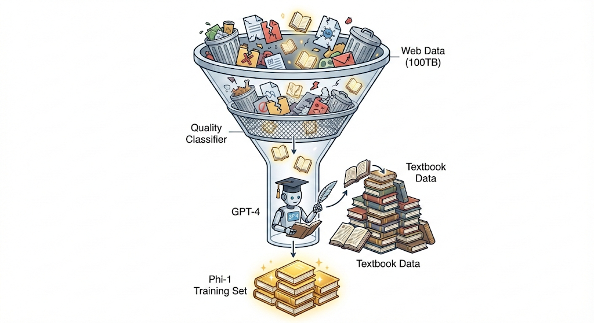

# 第10章：合成数据 (Synthetic Data) —— 从“数据挖掘”到“数据农场”

## 本章摘要


随着大模型竞赛的白热化，公网上的高质量自然数据（Natural Data）正在面临枯竭的危机。我们几乎已经“读”完了整个互联网，但模型的智力上限远未触达。此时，合成数据（Synthetic Data）不再是一个可选项，而是模型能力跃升的新引擎。本章将深入剖析微软 Phi 系列模型的“教科书级”数据合成方法，探讨如何从被动的“数据采集者”转变为主动的“数据创造者”。

我们将不仅限于生成文本，而是通过 Program of Thought (PoT) 利用代码执行来构建严密的逻辑验证闭环，以及如何利用 GPT-4o 等多模态模型合成复杂的图文指令数据。我们将展示如何从简单的“模仿人类”转向“超越人类”，通过算法手段构建出比真实世界更纯净、更具教育意义的训练集。

### 学习目标 (Learning Objectives)
* 构建 “Textbook Quality” 分类器，从海量 Web 数据中筛选高价值样本。
* 实现 PoT (Program of Thought) 数据生成流水线，利用 Python 解释器验证数学/代码数据的正确性。
* 掌握基于 LLaVA/GPT-4o 的多模态指令合成技术，构造图像推理问答对。

### 场景引入：当数据成为瓶颈
>“你正在训练一个专门用于 Python 编程的小型模型（1.3B）。为了让它尽可能强大，你编写爬虫爬取了 GitHub 上所有的开源代码。然而，当训练结束进行测试时，你绝望地发现模型学会了写满是 Bug 的代码，甚至学会了在函数里写‘TODO: Fix this later’或者‘This code is trash, do not use’。
仅仅增加数据量已经无效了，因为你喂给模型的垃圾越多，它的输出就越混乱。这时候，微软的 Phi-1 论文给了你一记当头棒喝：‘Textbooks Are All You Need’。你需要的是像教科书一样逻辑清晰、注释完美、由浅入深的教学代码，而不是只有上帝和原作者能看懂的‘屎山’。但是，去哪里找几百亿 Token 的完美教科书呢？既然找不到，我们就必须学会凭空‘变’出这些数据。如何构建一个不知疲倦的‘虚拟教授’来批量生产这些完美的教材？这就是本章要解决的核心工程挑战。”

---

## 10.1 核心概念与原理 (Concepts & Principles)

合成数据的核心挑战在于**质量控制**与**验证闭环**。因为模型生成的文本如果不加检查，往往包含幻觉或错误。如果使用含有错误的数据训练模型，会导致模型产生“自我吞噬”（Model Autophagy）或“模型坍塌”（Model Collapse），即模型输出的方差逐渐消失，内容变得极度同质化且脱离现实。本章介绍的三种方法分别解决了文本、代码/数学、多模态数据的质量问题。

### 10.1.1 为什么合成数据的质量远比数量重要？
在深度学习的早期，我们迷信“数据量即正义”，认为只要数据足够多，模型就能学会一切。但在合成数据时代，这一信条被彻底推翻。

**信噪比理论 (Signal-to-Noise Ratio):**
模型的训练本质上是一个压缩信息的过程。高质量数据（如教科书）具有极高的信息密度和严密的逻辑链条，模型只需要很少的样本就能捕捉到其背后的规律。而低质量数据（如论坛灌水、闲聊）充满了噪音和逻辑断层。如果训练集中混入了大量低质量合成数据，模型为了降低 Loss，会被迫去拟合这些噪音，导致“逻辑电路”短路。

这就好比学习物理，读一本经典的《费曼物理学讲义》（高质量合成数据）胜过刷一万条碎片化的物理科普短视频（低质量数据）。Phi-1 的成功证明了：6B Token 的教科书级数据，其训练效果可以吊打 1000B Token 的网络爬取数据。在合成数据领域，**验证（Verification）的成本**成为了新的货币。

### 10.1.2 教科书级数据 (Textbooks Are All You Need)
微软 Phi-1 的核心思想是：与其用 1TB 垃圾数据训练，不如用 6B Token 的高质量数据。其核心在于构建一个“过滤器”和一个“放大器”。

首先，我们并不是完全抛弃 Web 数据，而是训练一个分类器（Quality Classifier），专门识别那些“具有教育价值”的内容。这不仅仅是看语法是否正确，更是看内容是否逻辑自洽、是否包含定义与推理。其次，我们利用强大的生成式模型（如 GPT-4）作为“扩音器”，参考这些高质量片段，合成出风格类似但内容全新的、自包含的知识片段。


<figure>
  
  <figcaption align="center"><b>图 10-1： Phi-1流程示意图</b></figcaption>
</figure>

### 10.1.3 代码与数学合成：PoT (Program of Thought)

LLM 本质上是一个概率模型，它不具备真正的逻辑推理芯片。因此，让 LLM 做算术运算（如 234 * 567）或复杂逻辑推演时，它很容易产生幻觉。PoT (Program of Thought) 的思想是：既然 LLM 不擅长计算但擅长翻译，不如让它把数学问题“翻译”成代码，然后让 Python 解释器来计算结果。

这是合成数据中唯一能做到 **100% 准确率验证** 的领域。我们将生成的代码放入 Python Sandbox 执行。如果报错，直接丢弃；如果运行成功，执行结果即为 Ground Truth。这种“执行即验证”的机制，彻底解决了合成数据无法验证正确性的难题，使得我们可以低成本地生成无穷无尽的数学和逻辑推理数据。

**表 10-1：合成数据验证策略对比**

| 数据类型 | 生成器 (Generator) | 核心挑战 | 验证者 (Verifier) | 验证机制 |
| :--- | :--- | :--- | :--- | :--- |
| **通用文本** | GPT-4 / Gemini | 幻觉 (Hallucination) | LLM (Judge) / Reward Model | 依赖强模型打分，一致性较低，且容易出现“裁判偏见” |
| **数学/逻辑** | GPT-4 + PoT Prompt | 计算错误 | Python Interpreter | **执行一致性**：代码运行结果与预设答案匹配，逻辑绝对正确 |
| **代码 (Code)** | DeepSeek Coder / GPT-4 | 语法错误、逻辑 Bug | Unit Tests / Compiler | **单元测试**：通过 assert 断言或成功编译，确保功能正常 |
| **多模态** | GPT-4o / LLaVA | 视觉幻觉 (无中生有) | CLIP Score / Grounding DINO | 检查生成的描述是否与图片 Embedding 相似，防止编造不存在的物体 |

### 10.1.4 多模态指令合成：跨越感知的桥梁

对于图像数据，传统的标注成本极高且描述简短。LLaVA 提出了一种天才般的“盲人摸象”策略。我们利用现有的检测模型将图像转化为符号化的文本描述（Caption + Bounding Boxes），然后将这些纯文本喂给强大的纯文本模型（如 GPT-4）。GPT-4 虽然看不见图，但它可以通过这些元数据“想象”出图像的内容，并基于此生成复杂的推理对话。这不仅解决了多模态数据稀缺的问题，还极大地提升了指令的复杂度和逻辑性。

---

## 10.2 工程实现 (Engineering Implementation)

本节我们将深入代码层面，构建一套完整的数据合成流水线。我们将重点关注如何保证数据的多样性，防止生成的“教科书”千篇一律。

### 10.2.1 教科书级数据：分类器与合成流水线

**Step 1: 训练质量分类器 (The Quality Classifier)**
我们需要训练一个轻量级模型（如 Random Forest 或 BERT-Tiny），从海量数据中挑出“教科书”。这里的关键在于标注数据的来源。通常，我们需要人工专家或 GPT-4 仔细标注几千条数据作为种子。

**代码实现：特征工程与训练**
```python
import pandas as pd
from sklearn.ensemble import RandomForestClassifier
from sklearn.feature_extraction.text import TfidfVectorizer
from sklearn.pipeline import Pipeline

# 1. 准备标注数据 (Annotation)
# 我们首先用 GPT-4 标注少量样本（例如 1000 条），作为“金标准”
# Prompt: "Determine if this text is of educational value for a student..."
# Label 1: High Quality (Textbook-like), Label 0: Low Quality (Noise)
# 这一步至关重要，标注的质量直接决定了分类器的上限
data = [
    {"text": "Python lists are mutable sequences...", "label": 1},
    {"text": "Hey guys check out my cat photo...", "label": 0},
    # ... more data
] 
df = pd.DataFrame(data)

# 2. 构建分类器流水线
# Phi-1 论文中使用预训练模型的 Embedding，这里简化使用 TF-IDF 演示原理
# 在实际生产中，建议使用 DeBERTa-v3-small 等轻量级 Transformer 获取 Embedding
pipeline = Pipeline([
    ('tfidf', TfidfVectorizer(max_features=5000, stop_words='english')),
    ('clf', RandomForestClassifier(n_estimators=100, n_jobs=-1))
])

# 3. 训练
X = df['text']
y = df['label']
pipeline.fit(X, y)

# 4. 预测 (Filtering Phase)
# 对海量 Web 数据进行打分，只保留高分数据
web_snippet = "Standard library documentation for Python..."
score = pipeline.predict_proba([web_snippet])[0][1]

if score > 0.8:
    print("Keep this data for training: High Educational Value")
else:
    print("Discard: Low Signal-to-Noise Ratio")
```

**Step 2: 合成教科书片段 (Synthetic Generation)**
拥有了分类器过滤出的种子数据后，我们需要将其“扩写”。这里的 Prompt 设计需要极高的技巧。

Prompt 迭代：合成 Python 教程
* **V1 Prompt:** "Write a tutorial about Python lists."
    * **结果：** 平铺直叙，缺乏深度，像是一篇平庸的博客文章。
* **V3 Prompt (Phi-style):** 引入了具体的教学法（Pedagogy），要求包含定义、对比、复杂度分析和陷阱警示。

```python
# V3 Prompt - 教科书风格合成
synthetic_textbook_prompt = """
### ROLE
You are a professor of Computer Science writing a definitive textbook on Python.

### OBJECTIVE
Write a comprehensive, self-contained chapter section on the topic: "List Comprehensions vs. Map/Filter".

### REQUIREMENTS
1. **Tone**: Educational, clear, precise, and rigorous. Avoid conversational filler.
2. **Structure**:
   - Start with a conceptual definition explaining *why* this feature exists.
   - Provide a "Before and After" code example (Loop vs. Comprehension).
   - Explain the *computational complexity* (Big O) implications.
   - Include a "Common Pitfall" section (e.g., readability vs. brevity).
3. **Diversity**: Use realistic variable names (e.g., `inventory_items`, `sensor_readings`), NOT generic ones like `x`, `y`, `foo`. 
   (This is crucial to prevent the model from overfitting to toy examples).

### OUTPUT
[Markdown Content]
"""
```

### 10.2.2 逆向翻译 (Back-Translation)：从答案反推问题
除了从头生成，另一种高效方法是“逆向翻译”。在代码领域，我们通常很容易找到高质量的代码片段（例如 GitHub 上的高星库函数），但缺乏对应的自然语言指令。

我们可以利用 LLM 的总结能力，输入一段复杂的代码，要求模型：“请为这段代码编写一个尽可能详细的各种用户需求指令，使得这段代码恰好能解决这个问题。”这能快速生成大量 (Instruction, Output) 对，且 Output 保证是高质量的人类代码。这种方法特别适合增强模型对复杂代码逻辑的理解能力。

### 10.2.3 代码与数学合成：PoT (Program of Thought)
这是保证合成数据正确性的最强手段。通过强制模型生成代码，我们将模糊的自然语言推理转化为了精确的程序逻辑。

**核心代码拆解：生成与验证闭环**
```python
import subprocess
import tempfile
import os

# 1. PoT 生成 Prompt
# 我们要求模型把解题步骤写成 Python 函数 solver()
pot_prompt = """
Question: Janet has 3 times as many eggs as Bob. Bob has 5 eggs. How many eggs do they have in total?

Instruction:
Write a Python function named `solver()` that returns the answer.
Do not output the number directly. Write the code to calculate it.
Include comments explaining the logic.
"""

# 假设 LLM 返回了以下代码字符串
generated_code = """
def solver():
    # Bob has 5 eggs
    bob_eggs = 5
    # Janet has 3 times as many as Bob
    janet_eggs = 3 * bob_eggs
    # Total eggs
    total = janet_eggs + bob_eggs
    return total
"""

# 2. 代码执行沙箱 (Sandbox Execution)
# 警告：直接执行生成的代码极其危险，必须在沙箱中运行
def execute_generated_code(code_str):
    try:
        # 生产环境请使用 Docker, gVisor 或 nsjail 进行隔离
        local_scope = {}
        
        # 限制执行时间，防止死循环
        # 这里使用简化的 exec 演示，实际需配合 resource 模块限制 CPU/内存
        exec(code_str, {}, local_scope)
        
        if 'solver' in local_scope:
            result = local_scope['solver']()
            return result, "Success"
        else:
            return None, "No solver function found"
    except Exception as e:
        return None, f"Execution Error: {str(e)}"

# 3. 验证与数据保存
result, status = execute_generated_code(generated_code)

if status == "Success":
    print(f"Verified Answer: {result}")
    # 保存数据策略：
    # 策略 A (PoT): 保存 Instruction -> Code。训练模型写代码解题。
    # 策略 B (CoT): 保存 Instruction -> "Let's calculate... [Reasoning]... The answer is {result}"。
    # 策略 B 利用代码作为中间步骤，生成纯文本推理数据。
    save_to_dataset(pot_prompt, generated_code, result)
else:
    print("Discard bad data: Code failed to execute")
```
**实战技巧 (Pro Tip):** 生成的数据不仅可以用来训练 PoT 模型，还可以用来训练普通的 CoT 模型。方法是将执行成功的代码作为“中间步骤”，将执行结果作为“最终答案”，反向构造成 `<thinking>...code...</thinking><answer>...result...</answer>` 的格式。这种“借鸡生蛋”的方法可以显著提升纯文本模型的算术准确率。

### 10.2.4 多模态指令合成：LLaVA Pipeline

利用纯文本模型合成多模态数据是 LLaVA 的创举。这种方法的核心在于将视觉信息**“符号化” (Symbolization)**——既然纯文本模型（如 GPT-4）看不见图像，我们就把图像翻译成它能读懂的“代码”。


<figure>
  
  <figcaption align="center"><b>图 10-2： LLaVA 数据合成流程示意图</b></figcaption>
</figure>

#### 1. 工程流水线：从像素到符号

在设计 Prompt 之前，我们需要先通过工具链把图像“解构”为文本模型可读的结构化数据（Metadata）：

1.  **全局语义 (Captioning)**
    * **工具**: 使用 CLIP 或 BLIP 生成一句话描述。
    * **作用**: 提供整体语境（Context）。
    * **输出示例**: ` "A young girl riding a horse on a beach at sunset." `

2.  **局部细节 (Object Detection)**
    * **工具**: 使用 Grounding DINO 提取物体及其坐标（Bounding Box）。
    * **作用**: 提供空间位置实体（Spatial Anchoring）。
    * **输出示例**: ` {'girl': [100, 200, 300, 400], ...} `

3.  **数据合成 (Synthesis)**
    * **动作**: 将上述信息填入 Prompt，调用 GPT-4 生成对话。

#### 2. Prompt Engineering：设计与考量

有了结构化数据后，Prompt 的设计就成了决定数据质量的关键。以下是 LLaVA 风格的 Prompt 模板及其设计背后的架构考量：

```python
# System Prompt for Multimodal Data Generation
multimodal_gen_prompt = """
### CONTEXT
You are an AI visual assistant. You cannot see the image directly, but I will provide its metadata.
Your task is to generate a conversation between a Human and Yourself about this image.

### IMAGE METADATA
# [数据注入点]：我们将流水线提取的数据填入这里
- **Caption**: "{caption}"
- **Objects**: {object_list_with_boxes}

### INSTRUCTIONS
1. **Conversation Style**: Generate a multi-turn Q&A (User asking, Assistant answering).
2. **Reasoning**: The Human should ask complex questions (e.g., "What suggests this is a safe environment?"). You answer based on the visual evidence.
3. **Spatial Awareness**: Use the bounding box info to describe relative positions if asked (e.g., "The ocean is in the background...").
4. **Visual Consistency**: Do NOT hallucinate objects not listed in the metadata.
"""
```

**Prompt 设计背后的架构考量：**

* **为什么要同时提供 Caption 和 Objects？（互补性）**
    仅有 Object（女孩、马、海）是离散的，缺乏动作和氛围；仅有 Caption（女孩骑马）缺乏具体的方位信息。两者结合，GPT-4 才能构建出完整的思维“场景图（Scene Graph）”。

* **为什么要强调 "Spatial Awareness"？（空间对齐）**
    纯文本模型天生缺乏空间感。通过强制它处理 `[x1, y1, x2, y2]` 坐标数据，我们实际上是在强迫文本模型学习“视觉对齐”，让它学会理解“左边”、“右下角”等概念对应的像素区域。

* **为什么要加入 "Visual Consistency" 约束？（抑制幻觉）**
    文本模型最大的缺陷是容易“脑补”。例如看到“海滩”，它可能会顺嘴编出“有海鸥在飞”。必须显式禁止它生成 Metadata 中不存在的物体，以保证生成数据的高信噪比（High Signal-to-Noise Ratio）。

* **为什么要生成 "Complex Reasoning"？（数据升维）**
    如果只是简单的“这是什么？这是马”，对模型训练没有价值。我们需要利用 GPT-4 的智力，通过数据合成人为创造出“需要思考”的样本（如因果推断、情绪分析），从而让小模型（Student）通过蒸馏学会大模型的推理能力。
---

### 10.2.5 多模态指令数据合成的进阶策略

虽然基于纯文本模型的“符号化推理”（如 LLaVA v1 早期方法）开创了多模态指令合成的先河，但其主要缺陷在于“视觉信息的有损压缩”——文本模型无法直接感知像素级的视觉特征，仅依赖元数据（Metadata）进行推理容易导致幻觉（Hallucination）。

为了突破这一瓶颈，当前工业界与学术界已经演化出三种更为主流且高效的合成策略：**视觉强模型蒸馏**、**多专家混合流水线**以及**进化指令生成**。

#### 1. 视觉强模型蒸馏 (Visual Model Distillation)

这是目前（截至 2024-2025 年）构建高性能开源多模态模型（如 LLaVA-NeXT, ShareGPT4V）的最主流方法，常被视为 SOTA（State-of-the-Art）方案。

**核心思想**
该方法摒弃了“利用文本模型猜测视觉内容”的路径，转而采用“教师-学生”（Teacher-Student）蒸馏范式。利用闭源的顶尖多模态大模型（如 GPT-4o, Gemini 1.5 Pro）作为“教师模型”，直接处理原始图像信号，生成高质量、高密度的详细描述（Dense Caption）和复杂的推理问答对，供开源模型（学生模型）学习。

**优势分析**
* **消除模态隔阂**：教师模型直接“看”到图像像素，能够捕捉光影、材质、微表情等文本元数据无法承载的细节。
* **抑制幻觉**：基于真实视觉输入的描述极大降低了事实性错误的概率。

**实现流程**
其核心在于构建一个能够诱导教师模型输出详尽信息的 Prompt。以下是一个标准的蒸馏流程伪代码：

```python
def generate_dense_instruction(image_path, api_client):
    """
    利用 SOTA MLLM 生成高密度多模态指令数据
    """
    
    # System Prompt 设计关键：要求极其详尽的细节捕捉与逻辑关联
    distillation_prompt = """
    You are an expert visual analyst. Analyze the provided image with extreme detail.
    
    Tasks:
    1. Dense Captioning: Provide a comprehensive description of every corner of the image, covering colors, textures, lighting, and background details.
    2. Object Relationships: Analyze the interactions between objects (e.g., causality, spatial relations).
    3. OCR Extraction: Transcribe any visible text verbatim.
    4. Q&A Generation: Based on the visual details above, create a logical reasoning question that cannot be answered without looking at the image.
    """

    # 关键差异：输入包含真实的 Image Tensor，而非仅仅是 Bounding Box
    response = api_client.chat.completions.create(
        model="gpt-4o",
        messages=[
            {"role": "system", "content": distillation_prompt},
            {"role": "user", "content": [{"type": "image_url", "url": image_path}]}
        ]
    )
    
    return parse_response(response)
```

---

#### 2. 领域特化：多专家混合流水线 (Mixture-of-Experts Pipeline)

对于通用大模型难以覆盖的垂直领域——如文档智能（Document AI）、复杂图表分析或自动驾驶数据，通用的视觉蒸馏往往缺乏精度。此时，采用“多专家混合”策略是最佳实践。

**核心逻辑**
该方法不依赖单一模型的端到端能力，而是组装多个专用的小模型（Experts）作为感知前端，将非结构化图像转化为精细的结构化数据，再由 LLM 进行整合。

逻辑流：
$$ \text{Image} \xrightarrow{\text{Experts}} [\text{OCR} + \text{Layout} + \text{Detection}] \xrightarrow{\text{Aggregation}} \text{Structured Context} \xrightarrow{\text{LLM}} \text{Instruction} $$

**应用场景与流程图解**
典型应用包括金融票据处理（Invoices）、医疗影像报告（DICOM）等。

1.  **OCR Expert (如 PaddleOCR)**: 提取图像中所有文本及其精确坐标 $(x_1, y_1, x_2, y_2)$。
2.  **Layout Expert (如 LayoutLM)**: 解析文档的拓扑结构，识别表格行列、段落层级和标题关系。
3.  **Synthesis (LLM)**: 将上述结构化数据填入 Prompt 模板。
    * *Example Prompt:* “这是一张发票的结构化数据，发票号码位于 (100, 200)，金额总计为 500.00。请基于此生成一个关于‘财务审计核对’的多轮问答。”


<figure>
  
  <figcaption align="center"><b>图 10-3： 多专家混合流水线示意图</b></figcaption>
</figure>

---

#### 3. 进化指令生成 (Visual Evol-Instruct)

受纯文本领域 WizardLM 的启发，Visual Evol-Instruct 旨在解决训练数据“同质化”和“简单化”的问题。当基础数据集仅包含简单的识别任务（如“图里有什么？”）时，模型无法学会高阶推理。该方法通过 Prompt Engineering 强制让模型对现有数据进行“升维”。

**核心逻辑**
$$ \text{Simple VQA} \xrightarrow{\text{Complexity Constraints}} \text{Complex Reasoning VQA} $$

通过向 LLM 施加特定的进化指令，可以从以下维度提升数据复杂度：

* **深度推理化 (Reasoning)**:
    * *原题*: “这个人手里拿着什么？”
    * *进化后*: “结合手中物体的用途和人物的穿着，推测此人的职业以及他接下来可能进行的活动。”
* **反事实推理 (Counterfactual)**:
    * *原题*: “图中的车是红色的。”
    * *进化后*: “如果将图中的红色跑车替换为一辆老旧的自行车，整个场景的氛围会发生怎样的变化？这是否符合背景中出现的现代建筑风格？”
* **比较分析 (Comparative)**:
    * 输入两张相似图像，要求模型分析其细微差异（如光照变化、物体位移），训练模型的细粒度观察力。

通过上述三种策略的组合使用，我们可以构建出既包含丰富视觉细节，又具备深度逻辑推理能力的高质量多模态指令数据集，为训练 LLaVA、MiniGPT-4 等模型打下坚实基础。

## 10.3. 性能与评估 (Performance & Evaluation)

在合成数据上训练完模型后，评估显得尤为重要，因为我们需要确认模型是真的“学会了”还是仅仅“记住了”合成数据中的模式。

### 评价指标
* **Pass@1 (代码):** 对于 PoT 合成数据，我们在 HumanEval 上测试 Pass@1。Phi-1 仅用 6B 数据就达到了 50%+ 的 Pass@1，超过了许多训练数据量大 100 倍的模型。这证明了数据质量的压倒性优势。
* **Hallucination Rate (幻觉率):** 比较合成的多模态回答与原图的 CLIP 相似度，检测是否生成了图中不存在的物体。我们可以构建一个负样本集，专门诱导模型回答不存在的物体，看模型是否能拒绝回答。
* **Decontamination (去污染检测):** 这是一个肮脏但必须的步骤。我们需要检查合成数据是否无意中包含了测试集（如 HumanEval）的题目。通过 N-gram 重叠检测，确保模型是在泛化而非作弊。

### 基准测试
* **PoT vs CoT:** 在数学题（如 GSM8K）上，PoT 方法通常比纯文本 CoT 准确率高 5-10%。原因在于 PoT 将计算外包给了最擅长计算的 CPU，而让 GPU 专注于其擅长的逻辑翻译，这是一种最优的算力分配。

---

## 10.4. 避坑指南 (Pitfalls & Troubleshooting)

合成数据虽然美好，但也充满了陷阱。稍有不慎，模型就会陷入“自我陶醉”的怪圈。

* **陷阱 1：Self-Confirmation Bias (自证偏差)**
    * **现象：** 模型生成的代码虽然能跑通，但逻辑是错的（例如 2+2=5，且模型生成的测试用例也是错的，恰好通过了错误的函数）。
    * **修正：** 必须引入外部的、确定性的 Solver 或经过人工审核的 Unit Tests 库。永远不要完全依赖模型生成的测试用例来验证模型生成的代码，这就像让罪犯自己审判自己。

* **陷阱 2：Lack of Visual Grounding (视觉锚点缺失)**
    * **现象：** 多模态合成数据中，模型讨论了 metadata 中没提到的细节（瞎编）。例如，Metadata 里只有“狗”，模型却开始描述“狗项圈的颜色”，而图片里的狗根本没戴项圈。
    * **修正：** 在 Prompt 中加入 strict instruction：“Only strictly rely on the provided metadata. Do not invent details.” 同时，使用 CLIP Score 过滤掉那些与原图相似度过低的生成文本。

* **陷阱 3：The Homogenization Trap (同质化陷阱)**
    * **现象：** 如果所有数据都由 GPT-4 生成，你的模型最终会变成一个“低配版 GPT-4”，失去了多样性。所有的回答语气、句式都惊人的一致。
    * **修正：** **熵注入 (Entropy Injection)**。在 Prompt 中随机注入不同的 Persona（如“暴躁的程序员”、“耐心的幼儿园老师”），或者要求模型使用不同的编程风格（递归 vs 迭代），强制扩展数据的分布范围。

---

## 10.5. 本章小结与延伸阅读

Textbooks Are All You Need” 范式确立了数据质量（即教育价值）优先于数量的核心原则，而合成数据技术赋予了我们要精确控制数据信噪比的能力。在此体系下，程序思维（PoT）通过将推理过程转化为可执行代码，利用编译器的确定性来验证逻辑，从而保证了数据的严谨性。同时，Symbolic-to-Synthetic 方法利用元数据（如 Bounding Box）引导文本模型生成多模态内容，实现了从单模态向多模态数据的有效转化。这一系列演进标志着数据工程正在经历从被动“挖掘”到主动“生产”的模式转变：即通过种子提示词构建（Seed Prompts）、指令复杂化（Evolution）、质量过滤（Filtering）与最终合成（Synthesis）的标准工业化流程，系统性地构建高质量数据集。

### 参考文献
* *Gunasekar, S., et al. (2023). Textbooks Are All You Need (Phi-1).*
* *Chen, W., et al. (2022). Program of Thoughts Prompting: Disentangling Computation from Reasoning for Numerical Reasoning Tasks.*
* *Liu, H., et al. (2023). Visual Instruction Tuning (LLaVA).*
* *Shumailov, I., et al. (2023). The Curse of Recursion: Training on Generated Data Makes Models Forget.* (关于模型坍塌的重要研究)